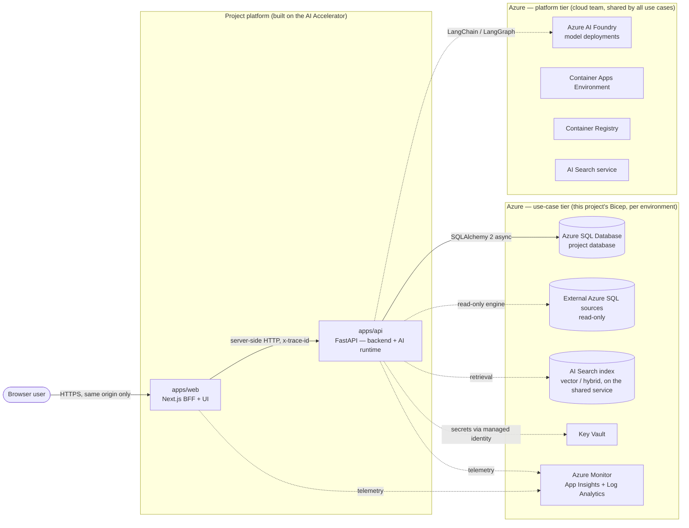
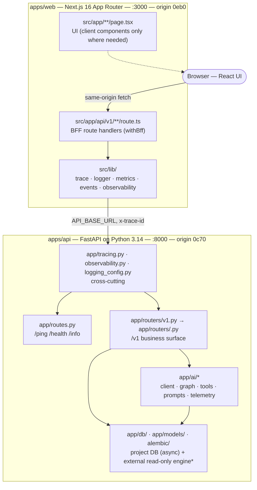

# Architecture — living document

This is the **one architecture file** for a project built on the AI Accelerator. It has two
parts with different owners:

| Part                                                               | Owner                                                                  | Rule                                                                                                                                                                                                                                       |
| ------------------------------------------------------------------ | ---------------------------------------------------------------------- | ------------------------------------------------------------------------------------------------------------------------------------------------------------------------------------------------------------------------------------------ |
| **[Part A — Template baseline](#part-a--template-baseline)**       | The template (Orion Digital Solutions for the Diriyah Company AI team) | **Template-owned. Do not edit in a project.** It changes only when the template itself changes (a template release, recorded in [`docs/template-roadmap.md`](../template-roadmap.md)). Every project architecture is built _on top of_ it. |
| **[Part B — Project architecture](#part-b--project-architecture)** | The project team (admin + developers)                                  | **Team-maintained, by hand.** Claude and the `.claude/` skills **read** it before planning and may **propose** edits as a diff or a `Proposed` ADR — they never rewrite it on their own (ADR-0006).                                        |

If anything here disagrees with the code, **the code wins** — then fix this file (root
`CLAUDE.md`, rule 14). Deep-dives behind Part A: [overview.md](overview.md),
[tracing.md](tracing.md), [observability.md](observability.md), [data.md](data.md).

---

## Part A — Template baseline

> Template-owned. A project does not edit this part.

### A1. What the baseline is

A **use-case-agnostic accelerator** for AI applications on Azure: two independent services
wired with end-to-end request tracing and Azure Monitor observability, a database layer ready
for real models, and a `.claude/` toolkit (rules, agents, skills) so that most of the code is
written by Claude under human approval. It ships **plumbing, not product**: no business
domain, no auth, no AI feature — those are the project's job, built in the slots below.

### A2. Principles (non-negotiable in every project)

1. **One inbound edge.** The browser talks only to `apps/web` (the BFF). Service URLs and
   secrets are server-side only; never `NEXT_PUBLIC_*`.
2. **One backend.** `apps/api` (FastAPI) is the sole backend and the sole owner of data access
   and of the AI runtime. `web` is a pass-through BFF plus UI.
3. **One trace id.** `x-trace-id` = origin(4 hex) + env(1 hex) + random(27 hex); minted at the
   edge, forwarded unchanged on every hop, echoed on every response, present on every log line
   and span attribute. Origins: `web=0eb0`, `api=0c70` (`0a71` retired).
4. **Observability is fail-safe and always on.** OpenTelemetry → Azure Monitor; without a
   connection string the services still run (degraded mode, visible on `/health`). Structured
   JSON logs only; secrets redacted at source; bounded metric attributes.
5. **Every business endpoint is versioned** under `/v1` (ADR-0001). Only `/ping`, `/health`,
   `/info` are exempt.
6. **Databases are Azure SQL, on Azure — never locally.** A project's own database is
   **created by infrastructure first**, then modelled (SQLAlchemy 2 async) and migrated
   (Alembic). Migrations are applied by a gated pipeline job or a named human, never by an
   agent. External databases are accessed **read-only** through a separate engine
   (`app/db/external.py`). Driver: `mssql+aioodbc` on ODBC Driver 18, managed-identity auth when
   deployed (ADR-0008).
7. **Infrastructure is Bicep, in two tiers (ADR-0012).** The **platform tier** — Azure AI
   Foundry with its model deployments, the Container Apps Environment, the Container Registry
   and the AI Search service — pre-exists per environment, is owned by the cloud team and is
   **shared by every use case**; the template only references it (`existing`, names from
   `infra/platform/<env>.json`). The **use-case tier** — this project's container apps,
   database, storage, Key Vault, Application Insights, Search index — is `infra/main.bicep`
   composed from the infra team's **vendored building blocks** (`infra/modules/`, never edited
   here) with names per environment in `main.<env>.bicepparam`. GitHub Actions runs `what-if`
   on PR and deploys on merge in every environment; developers may deploy locally to `dev`.
   Roles a use case needs on shared resources are **requested** (`infra/grant-request.md`),
   never assigned here. Agents may `bicep build`/`lint`; they never deploy.
8. **Tests, docs, and telemetry ship with the change** — a feature without them is not done
   (root `CLAUDE.md` → _Definition of Done_).
9. **Decisions are recorded** as ADRs in `docs/adr/`; the team's design inputs live in
   `docs/design/`; the plan of record lives in `roadmaps/`.

### A3. System context (C4 level 1)

Solid arrows exist in the template today. **Dashed arrows are baseline slots**: the template
defines where they attach and the rules they follow, and the project (or the template roadmap)
fills them in. Status per slot:

| Slot                   | In the template today                                                                                                                           | Filled by                                                                                 |
| ---------------------- | ----------------------------------------------------------------------------------------------------------------------------------------------- | ----------------------------------------------------------------------------------------- |
| Project database       | **Implemented**: lazy `mssql+aioodbc` engine, session dependency, Alembic wired, `migrate.yml` pipeline; **no models, no migrations** by design | Project models + revisions; DB created by the use-case Bicep first (`sql-database` block) |
| External data sources  | **Implemented**: `app/db/external.py` read-only engine (`EXTERNAL_DATABASE_URL`, non-SELECT refused)                                            | The project's `docs/design/external-systems.md` + the AI query tool (roadmap 4.6)         |
| AI runtime             | **Implemented**: `app/ai/` — client seam, `retrieve → answer` graph, tool registry, prompts, telemetry, SSE streaming, ingestion (ADR-0009)     | The project's routes, prompts, tools and eval cases                                       |
| Vector store           | **Implemented**: Azure AI Search via `tools/retrieve.py` + `ingest.py` (index definition) on the **shared** search service (platform tier)      | The project's index name, corpus and ingestion sources                                    |
| Key Vault / identities | Not present in code; ingestion auth via managed identity is implemented                                                                         | Use-case Bicep (`key-vault`, `user-assigned-identity` blocks; revision 2 Phase 2)         |
| Azure Monitor          | **Implemented** in both services; alerting stack authored in Bicep (`infra/modules/observability.bicep`, `alerts.bicep`)                        | Folded into the use-case `main.bicep` (revision 2 Phase 2)                                |
| App hosting            | Dockerfiles + compose only                                                                                                                      | Container apps in the **shared** Container Apps Environment (use-case Bicep)              |
| Auth                   | Not present — projects are **internal-only** until then                                                                                         | **Okta** OIDC module behind `AUTH_MODE=none\|okta` (roadmap Phase 8)                      |

### A4. Containers (C4 level 2)

`*` = baseline slot, not yet in the template code (see A3).

| App        | Stack                                                         | Port | Origin | OTel service name |
| ---------- | ------------------------------------------------------------- | ---- | ------ | ----------------- |
| `apps/web` | Next.js 16 (App Router), React 19, pino, OTel → Azure Monitor | 3000 | `0eb0` | `<slug>-web`      |
| `apps/api` | Python 3.14, FastAPI, SQLAlchemy 2 async, Alembic, structlog  | 8000 | `0c70` | `<slug>-api`      |

Independent packages: no pnpm workspace, per-app lockfiles and Dockerfiles, independent SemVer.

### A5. Request flows the baseline guarantees

1. **UI → BFF → api**: `withBff` adopts/mints the trace id → `fetchUpstream` forwards it →
   `TraceMiddleware` adopts it → business router → response echoes it. Upstream failure = BFF
   `502` with `trace_id`.
2. **api → project DB**: `Depends(get_session)` per request; ORM constructs; spans from the
   SQLAlchemy instrumentation (both engines). **api → external DB**:
   `Depends(get_external_session)`, read-only by construction.
3. **api → AI model / retrieval / external DB** _(slots)_: through `app/ai/` with per-call
   timeouts, `gen_ai` telemetry, no prompt content in logs, read-only external access.
4. **Long-running AI responses**: streamed over SSE from `/v1` through a pass-through BFF
   variant _(slot)_; non-streaming first.

### A6. Environments and delivery

- `APP_ENV` = `local | dev | staging | prod` drives the trace env nibble and the `env` log
  field. Same code path everywhere; config is env-var driven; secrets come from Key Vault.
- Branch promotion `development → staging → main` is enforced by CI; CODEOWNERS gate merges.
- Three resource groups (`dev`, `staging`, `prod`) host every use case. In each, the **platform
  tier** (Foundry, Container Apps Environment, Container Registry, AI Search service) pre-exists
  and is described by `infra/platform/<env>.json`; this project's **use-case tier** is
  `infra/main.bicep` + `main.<env>.bicepparam`, deployed by `.github/workflows/infra.yml`
  (`what-if` on PR, deploy on merge) or locally to `dev`. Roles on shared resources are
  requested from the cloud team (`infra/grant-request.md`).
- Azure SQL is reachable over public endpoints with firewall rules (Azure services + developer
  IPs) for now; private endpoints are a later hardening step.
- Migrations are applied per environment by a gated pipeline job _(target)_ — never
  automatically on deploy.

### A7. Delivery status of the baseline

Honest state of what exists (see also the root `README.md` → _Scope & delivery status_ and
[`docs/template-roadmap.md`](../template-roadmap.md)):

| Area                                          | State                                                                                                               |
| --------------------------------------------- | ------------------------------------------------------------------------------------------------------------------- |
| Two services + trace contract + observability | ✅ implemented and unit-tested                                                                                      |
| Data layer (engine, session, Alembic)         | ✅ Azure SQL via `mssql+aioodbc`, `migrate.yml` pipeline · ⏳ no models / migrations by design; first apply pending |
| External read-only data access                | ✅ `app/db/external.py` (unit-tested offline)                                                                       |
| AI runtime (`app/ai/`) + Azure AI Search      | ✅ implemented and unit-tested offline (ADR-0009); runtime proof against a live deployment pending                  |
| Infra as code                                 | ⏳ Bicep: observability/alerting modules exist; use-case `main.bicep` on the shared platform in progress (ADR-0012) |
| Auth                                          | ⛔ not included (internal-only); Okta module planned (roadmap Phase 8)                                              |
| Workflow skills (plan/implement/start)        | ⏳ planned (roadmap Phase 5)                                                                                        |

---

## Part B — Project architecture

> Team-maintained. Fill this in after `/rename-project` (later `/init-project`) and keep it
> current as the project evolves. Everything the planning skills generate starts from here and
> from `docs/design/`. Delete the guidance text in each section once you have written the real
> content.

### B1. Project summary

_One paragraph: what the application does, for whom, and the business outcome it serves. Name
the project's environments and the Azure subscription/resource-group naming convention._

### B2. Feature map

_The features the application will have, grouped by area. One line each with the owning
service(s) and a link to the roadmap item once planned. This is the input to `plan-roadmap`._

| Area | Feature | Services touched (web / api / ai / infra) | Roadmap item |
| ---- | ------- | ----------------------------------------- | ------------ |
|      |         |                                           |              |

### B3. AI components

_Which model deployments (Azure AI Foundry project, deployment names, regions), which
LangGraph graphs/agents exist and what each does, which tools they may call (retrieval,
external-DB queries, actions), prompt ownership, evaluation approach, guardrails (content
filters, injection defences, PII handling)._

| Component | Type (graph / tool / prompt / retriever) | Model / deployment | Data it may touch | Notes |
| --------- | ---------------------------------------- | ------------------ | ----------------- | ----- |
|           |                                          |                    |                   |       |

### B4. Data stores

_The project's own database (from `docs/design/db-design.md`), every external data source (from
`docs/design/external-systems.md`), the vector store, blob/file stores. For each: Azure
resource, environment, access mode (read/write vs read-only), owner, retention/PII class._

| Store | Kind | Environment(s) | Access from api | Owner | PII / retention |
| ----- | ---- | -------------- | --------------- | ----- | --------------- |
|       |      |                |                 |       |                 |

### B5. Integrations

_External APIs, identity providers, messaging/queues, file ingestion sources. Direction,
protocol, auth method, timeout policy, and the traced helper used._

### B6. Infrastructure topology

_Per environment: (a) the **platform references** this use case consumes — resource group,
Container Apps Environment, registry, Foundry endpoint + the deployment names it uses, AI Search
service — exactly as in `infra/platform/<env>.json`; (b) the **owned resources** — container
apps, Azure SQL server/database, storage, Key Vault, App Insights, the Search index name —
exactly as in `main.<env>.bicepparam`; (c) networking (firewall allowlist today; private
endpoints later); (d) the identities and the **grants requested** from the cloud team
(`infra/grant-request.md`) with their status. Add a diagram when it stops fitting in a table._

### B7. Security and auth posture

_Who the users are, how they authenticate (or the explicit "internal-only, no auth" decision),
authorization model (thread/record ownership, roles), data classification, threat models
written (`docs/security/threat-models/`)._

### B8. Decisions and open questions

_Links to the project's ADRs (`docs/adr/`) and the questions still open, each with an owner
and a date._

### B9. Change log of this document

| Date | Who | What changed |
| ---- | --- | ------------ |
|      |     |              |
