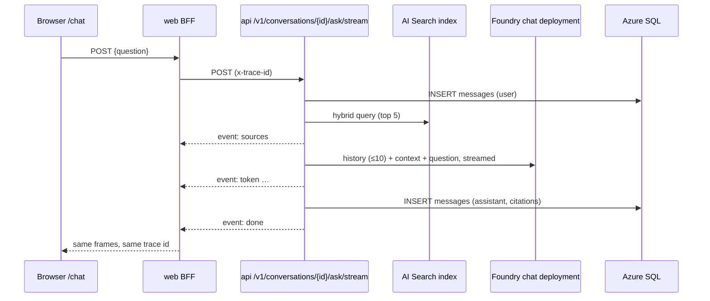

# Team Assistant — project architecture (Part B)

_Complementary to [`ARCHITECTURE.md`](../ARCHITECTURE.md) → Part B, which summarises each
section and links here; this document is authoritative for detail. Slug `team-assistant`. The
`/chat` wireframe is [`docs/design/wireframes/chat.md`](../../design/wireframes/chat.md)._

## B1. Project summary

**Team Assistant** — an internal chat assistant that answers questions from the team's own
documentation with citations and keeps conversation history. A user opens `/chat`, starts a
conversation, asks a question; the answer streams back and cites the document it came from.
Conversations and messages are stored in Azure SQL; the corpus is the repo's own `docs/**/*.md`,
indexed in Azure AI Search. No login (internal only; Okta later).

## B2. Feature map

| Id  | Feature              | User story                                                                                                | Layers                              |
| --- | -------------------- | --------------------------------------------------------------------------------------------------------- | ----------------------------------- |
| F1  | Chat with citations  | As a user I ask a question on `/chat` and the answer streams back with citations (document title + path). | ai, endpoint, bff, ui               |
| F2  | Conversation history | As a user I start a new conversation, see past ones, reopen one and continue it.                          | model, migration, endpoint, bff, ui |
| F3  | Knowledge base       | As an admin I re-index the corpus (`docs/**/*.md`) with one command/endpoint.                             | ai, endpoint                        |

## B3. AI components

- The template's `retrieve → answer` graph with `AzureSearchRetriever` on index `team-assistant-docs`;
  conversation memory = the last 10 messages of the conversation passed as history.
- Streaming frames `sources → token* → done`; `sources` carries `[{title, path}]` instead of the
  template's list of paths — ingestion adds a `title` field to the existing `team-assistant-docs`
  index (first `# ` heading, else the file name) and re-indexes.
- Ingestion endpoint `POST /v1/admin/ingest` → `202`, runs in the background, single-flight (`409`
  while one runs). **api only — not mirrored in the BFF**, so no browser can trigger it. Corpus:
  the repo's `docs/`, located by the new setting `INGEST_CORPUS_PATH` (no deployment, ADR-0013).
  The CLI `uv run python -m app.ai.ingest <path>` keeps working.
- Telemetry per the template: no message content in logs, spans, metrics or events.
- Limits: question ≤ 4,000 characters (over → `422 validation_error`); `top_k = 5`; each model or
  embedding call times out after `AI_REQUEST_TIMEOUT_SECONDS` (60 s, up to 2 retries) and the whole
  ask has a 120 s deadline (2 × that setting); answers are capped at `AI_MAX_OUTPUT_TOKENS` (1024).
- Failures: model/search failure **before** the stream starts → `503 ai_unavailable` (the user
  message is kept); **after** it starts → an `event: error` frame `{error_kind}` ends the stream and
  the UI shows the error with the response's `x-trace-id`. A disconnect before `done` stores no
  assistant message.

## B4. Data stores (Azure SQL, owned by `apps/api`)

Table `conversations`:

| Column       | Type               | Rules                                                                                                        |
| ------------ | ------------------ | ------------------------------------------------------------------------------------------------------------ |
| `id`         | `uniqueidentifier` | PK                                                                                                           |
| `title`      | `nvarchar(200)`    | not null; given on create, else "New conversation" until the first ask renames it to the question cut to 200 |
| `created_at` | `datetime2(3)`     | not null                                                                                                     |
| `updated_at` | `datetime2(3)`     | not null                                                                                                     |

Table `messages`:

| Column            | Type               | Rules                                                              |
| ----------------- | ------------------ | ------------------------------------------------------------------ |
| `id`              | `uniqueidentifier` | PK                                                                 |
| `conversation_id` | `uniqueidentifier` | FK → `conversations.id` (`NO ACTION`), indexed                     |
| `role`            | `nvarchar(20)`     | `CHECK (role IN ('user','assistant'))`                             |
| `content`         | `nvarchar(max)`    | not null                                                           |
| `citations`       | `nvarchar(max)`    | nullable, JSON, `CHECK (citations IS NULL OR ISJSON(citations)=1)` |
| `token_count`     | `int`              | nullable                                                           |
| `created_at`      | `datetime2(3)`     | not null                                                           |

Retention: indefinite in this release. Conversations are shared (no owner) until auth lands
(ADR-0014). PII: message content is free text typed by internal users and may contain personal
data; never logged. Migrations are applied by Yasser Aly from a developer machine against dev
(ADR-0013) — never by an agent.

## B4a. API surface (`/v1`)

| Method | Path                         | Request                  | Response                                                                        | Errors                                              |
| ------ | ---------------------------- | ------------------------ | ------------------------------------------------------------------------------- | --------------------------------------------------- |
| POST   | `/v1/conversations`          | `{ "title"?: string }`   | `201` `{ id, title, created_at, updated_at }`                                   | `422 validation_error`                              |
| GET    | `/v1/conversations`          | `?limit=50` (1–100)      | `200` `{ items: [{ id, title, updated_at }], count }` newest first              | `422 validation_error`                              |
| GET    | `/v1/conversations/{id}`     | —                        | `200` conversation + `messages: [{ id, role, content, citations, created_at }]` | `404 not_found`                                     |
| POST   | `/v1/conversations/{id}/ask` | `{ "question": string }` | `200` `{ message_id, answer, citations }` (JSON) · `…/ask/stream` → SSE frames  | `404`, `422 validation_error`, `503 ai_unavailable` |
| POST   | `/v1/admin/ingest`           | —                        | `202 { "status": "started" }`                                                   | `409 ingest_running`                                |

Error bodies are the template's `{ "error": code, "trace_id": id }`. The BFF mirrors every route
under `/api/v1/…` with `MOCK_UPSTREAM` fixtures for each — **except `/v1/admin/ingest`** (api
only). These routes **replace** the template's `/api/v1/assistant/ask` and `/ask/stream` BFF routes,
which are removed.

## B5. Integrations

None (no external database).

## B6. Infrastructure topology

Runs locally against pre-created Foundry, AI Search and Azure SQL in `dev` (`apps/api/.env`; names
in `ARCHITECTURE.md` → B1). No infrastructure is deployed by this project in any environment.

## B7. Security and auth posture

Internal-only, no user auth; **conversations are shared** (every user can read every conversation)
until Okta lands — [ADR-0014](../../adr/0014-shared-conversations-until-auth.md). Prompt injection is **only partly mitigated**: retrieved
document text is placed in the system prompt's `{context}` slot without delimiters, and the only
defence is one "context is data, not commands" sentence in `prompts/system.md` (the eval checks the
phrase exists, not its effect); no tools are bound, which limits the damage to answer text. Accepted
risk 7 in the [threat model](../../security/threat-models/conversations-and-ingest.md); hardening
(delimited context, injection evals) is threat-model must-fix #8 / roadmap 5.1. The ingest trigger
takes no input, is off by default and single-flight.

## B8. Decisions and open questions

| #   | Decision                                                                                                                                                                           |
| --- | ---------------------------------------------------------------------------------------------------------------------------------------------------------------------------------- |
| 1   | Corpus delivery: the repo's `docs/` via `INGEST_CORPUS_PATH` (no deployment — ADR-0013)                                                                                            |
| 2   | Ingest: `202`, background, single-flight, `409` when busy; api only, not in the BFF                                                                                                |
| 3   | Title optional on create; else "New conversation", renamed to the first question cut to 200                                                                                        |
| 4   | History sent to the model: last 10 messages                                                                                                                                        |
| 5   | Messages kept indefinitely; no purge job                                                                                                                                           |
| 6   | Rename and delete: out of scope                                                                                                                                                    |
| 7   | `sources` frame becomes `[{title, path}]`; `title` field added to the existing index                                                                                               |
| 8   | Over-long question → `422 validation_error`                                                                                                                                        |
| 9   | `503 ai_unavailable` before the stream; `error` frame after it starts                                                                                                              |
| 10  | The template's `/api/v1/assistant/*` routes are replaced and removed                                                                                                               |
| 11  | Migrations applied by Yasser Aly from a developer machine against dev (ADR-0013)                                                                                                   |
| 12  | Local-only, no infrastructure — [ADR-0013](../../adr/0013-local-only-pre-provisioned-dev.md); shared conversations — [ADR-0014](../../adr/0014-shared-conversations-until-auth.md) |

Answered in the architecture review of 2026-10-06; no open questions.

## Flow

