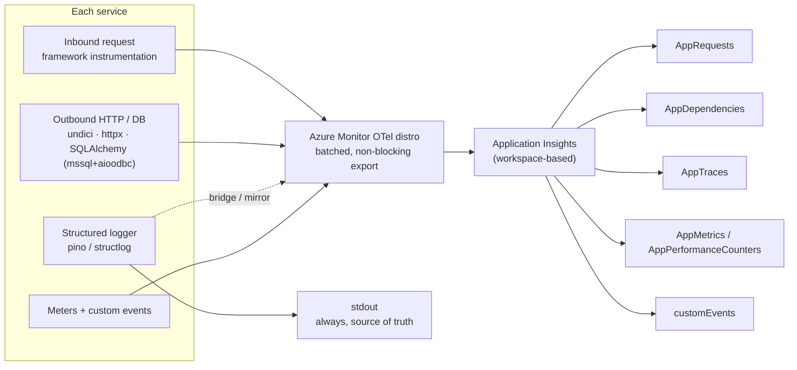

# Observability architecture

OpenTelemetry → **Azure Application Insights / Azure Monitor / Log Analytics**, in both
services, on **the same code path locally and deployed**. Configuration comes from
`APPLICATIONINSIGHTS_CONNECTION_STRING`; there is **no local monitoring stack** to install, and
no second code path that could drift from the deployed one.

The enforced contract is [`.claude/rules/60-observability.md`](../../.claude/rules/60-observability.md);
the operator-facing summary is the root [`README.md`](../../README.md) → _Observability &
logging_. This document explains how the pieces fit together and why each is shaped the way it
is.

> **The governing lesson:** App Insights **fails silent, not loud**. Wrong init order, an
> uncollected logging library, an incompatible instrumentation package, or a default sampler all
> produce a perfectly working application with quietly missing telemetry. Almost every design
> choice below exists to convert one of those silent failures into a visible one.

---

## Pillars and where they land



| Pillar                   | Produced by                                                                                         | App Insights table                      |
| ------------------------ | --------------------------------------------------------------------------------------------------- | --------------------------------------- |
| Server request spans     | Framework auto-instrumentation (Node `http`; explicit `FastAPIInstrumentor`)                        | `AppRequests`                           |
| Outbound HTTP + DB spans | undici (Node), httpx (Python), SQLAlchemy instrumentation over the `mssql+aioodbc` engines (Python) | `AppDependencies`                       |
| Structured logs          | pino / structlog, bridged to the OTel Logs pipeline                                                 | `AppTraces`                             |
| Metrics                  | Distro performance counters + runtime instrumentation + our custom instruments                      | `AppPerformanceCounters` / `AppMetrics` |
| Custom events            | `trackEvent` / `track_event`                                                                        | `customEvents`                          |

Queries for each are in the [KQL starter pack](../operations/kql-starter-pack.md). The
per-service inventory of what is automatic versus what this repo had to close by hand is the
table in [`60-observability.md`](../../.claude/rules/60-observability.md) → _Auto-instrumentation
inventory_.

---

## Init order — the first silent failure

Telemetry init must run **before any HTTP-server, HTTP-client, or DB library loads**. If it runs
later, auto-instrumentation patches modules that are already resolved, silently produces nothing,
and raises no error. Each runtime needs a different mechanism:

| Service | Mechanism                                                                                                                                                                                                                                                                                                                                                                                                                            |
| ------- | ------------------------------------------------------------------------------------------------------------------------------------------------------------------------------------------------------------------------------------------------------------------------------------------------------------------------------------------------------------------------------------------------------------------------------------ |
| `web`   | **Framework hook.** Next.js has already loaded its own server before app code runs, so a first-import is impossible. Init happens in [`src/instrumentation.ts`](../../apps/web/src/instrumentation.ts) `register()`, guarded to `NEXT_RUNTIME === 'nodejs'`, which Next runs once per server instance before serving requests.                                                                                                       |
| `api`   | **Explicit instrumentation.** `init_observability(app)` inside `create_app()` calls `configure_azure_monitor()`, then patches the frameworks directly (`FastAPIInstrumentor.instrument_app(app)`, `HTTPXClientInstrumentor().instrument()`, `SQLAlchemyInstrumentor().instrument()`) — no import-order fragility for HTTP; the DB engines resolve `create_async_engine` at call time so the wrapper registered here applies to them. |

Neither runtime relies on a "first import" any more: `web` cannot (Next owns the entry point) and
the `api` does not need to (the instrumentors patch classes, not the module loader).

### Idempotent init

Both services guard init behind a process-global flag — Node uses `Symbol.for` keys on `globalThis`
(so a second module _copy_ shares the flag), Python uses a module-level `_configured`. Calling
init twice never double-registers the SDK.

This is not hypothetical bookkeeping. Next.js can bundle `instrumentation.ts` and the route
handlers into **separate module graphs**, so `web` genuinely loads two copies of its
observability module. That is also why `getObservabilityState()` in `web` re-derives state from
the environment when it finds none stored — otherwise `/health`, served from the other graph,
would report the wrong reason.

---

## Sampling — pinned at 100%, never inherited

**Never trust the distro default.** `@azure/monitor-opentelemetry` ≥ 1.16.0 and
`azure-monitor-opentelemetry` ≥ 1.8.6 default to **rate-limited sampling at roughly 5
traces/second** — a silent telemetry cap that looks exactly like a working system under light
load and quietly drops data under real load.

Every service therefore pins a **fixed-percentage sampler** explicitly at init:

- Default ratio **1.0 (100%)**, tunable via **`TRACE_SAMPLING_RATIO`** (a float in `[0, 1]`,
  documented in every `.env.example`). Invalid values **warn and fall back to 1.0** — never
  crash, never silently under-sample.
- **Node** passes `samplingRatio` **and `tracesPerSecond: 0`**. The `0` is load-bearing: without
  it the rate-limited default still wins and `samplingRatio` is ignored.
- **Python** passes `sampling_ratio`.

### Precedence

The standard OTel env vars win, in both runtimes, by design — an operator setting
`OTEL_TRACES_SAMPLER` should not be overridden by our code:

- **Node:** the distro merges env configuration _after_ code options, so `OTEL_TRACES_SAMPLER` /
  `OTEL_TRACES_SAMPLER_ARG` naturally take precedence. `resolveSamplingRatio()` detects the env
  var only to report the correct `source` in the startup line.
- **Python:** `resolve_sampling_ratio()` returns `None` when `OTEL_TRACES_SAMPLER` is set, and
  the kwarg is then **omitted entirely** — because passing `sampling_ratio` would shadow the
  env-selected sampler.

The effective ratio and its source are reported in the api's startup log line, and `web`'s
`resolveSamplingRatio()` returns the ratio together with its `source`, so "why am I only seeing
some traces?" is answerable without reading code.

---

## Cloud role identity

Each service's OTel resource carries two attributes that determine how it appears in the
Application Map and in every table's `AppRoleName` / `AppRoleInstance` column:

| Attribute             | App Insights concept | Default                                                 |
| --------------------- | -------------------- | ------------------------------------------------------- |
| `service.name`        | cloud role name      | `ai-accelerator-web` / `ai-accelerator-api`             |
| `service.instance.id` | cloud role instance  | `CONTAINER_APP_REPLICA_NAME` → `HOSTNAME` → OS hostname |

Both are set through the **standard env vars** (`OTEL_SERVICE_NAME`,
`OTEL_RESOURCE_ATTRIBUTES`) that both distros' env resource detectors already read — no direct
dependency on `@opentelemetry/resources` is needed. `applyResourceDefaults()` /
`apply_resource_defaults()` implement this.

Two rules:

- **Append-only.** An operator-provided `OTEL_SERVICE_NAME` or an existing `service.name` /
  `service.instance.id` inside `OTEL_RESOURCE_ATTRIBUTES` is **never** overridden.
- **`service.namespace` is deliberately not set** — setting it switches App Insights to the
  `namespace.name` display format, which is not what the Application Map should show here.

---

## The log pipeline

**The structured stdout line is the source of truth. Export is a tee, never a replacement.**

Every line, in every service, carries: `timestamp`, `level`, `service`, `origin`, `env`,
`trace_id`, `message`. Node uses **pino**
([`apps/web/src/lib/logger.ts`](../../apps/web/src/lib/logger.ts)); Python uses **structlog**
([`apps/api/app/logging_config.py`](../../apps/api/app/logging_config.py)).
`console.log` and `print()` in committed code are forbidden.

### The export bridge — and why it exists

Neither distro collects our loggers. The Azure Node distro collects bunyan/winston — **pino is
not on its list** — and structlog **bypasses stdlib `logging` entirely**. Left alone, both
services would log beautifully to stdout and send nothing to `AppTraces`. So each service
bridges explicitly:

- **Node (`web`):** every serialized pino line is re-emitted through the **OTel Logs API**
  (`@opentelemetry/api-logs`); the distro's NodeSDK registers the global LoggerProvider.
- **Python:** every structlog event is mirrored into the stdlib logger **`app.telemetry`**,
  which propagates to `app`, where `configure_azure_monitor(logger_name="app")` attached its
  handler. Propagation from `app` to root is then switched **off**, so a bridged record does not
  also print a bare duplicate through the root stream handler — structlog already wrote the
  structured line.

Bridged records are emitted **synchronously inside the request context**, so they inherit the
active span context. That is what makes `AppTraces.operation_Id` match the corresponding
`AppRequests` row — the join in [KQL starter pack §2](../operations/kql-starter-pack.md).

The bridge is fail-safe in both directions: it is a no-op in degraded mode, any emit error is
swallowed, and the **local stdout write happens first**, so an export problem can never break
local logging. Opt out per logger with `buildLogger({ telemetryBridge: false })` (Node) or by
binding `telemetry_export=False` (Python) — which is exactly what the custom-event helpers do,
to avoid double-exporting an event as both a `customEvents` row and an `AppTraces` line.

### Redaction at source

Secret-bearing fields are replaced with **`[redacted]` during serialization — before any sink,
local or remote, sees the line.** Redacting at the sink would already be too late for the stdout
copy.

The default field list: `authorization`, `cookie`, `set-cookie`, `set_cookie`, `x-api-key`,
`token`, `access_token`, `refresh_token`, `id_token`, `password`, `secret`, `client_secret`,
`api_key`, `apiKey`, `connection_string`, `connectionString`.

Matching differs by runtime: **Node** matches exact paths at the top level and one level deep
(via pino's `redact`); **Python** matches case-insensitively with `-`/`_` normalized,
recursively. Extend per logger with `buildLogger({ redactPaths })` or
`configure_logging(extra_redacted_fields={…})`. If something leaks anyway, the recovery
procedure is [`runbooks/pii-purge.md`](../operations/runbooks/pii-purge.md).

Beyond redaction, the standing rule is simply: **no PII in log fields or span attributes** — no
emails, names, or tokens.

### Non-blocking sinks

- **Node:** stdout goes through `pino.destination({ sync: false })` — buffered, off the request
  path — with a best-effort synchronous flush of every sink on `process.on('exit')`.
- **Python:** rendered lines are handed to a queue drained by a daemon writer thread, flushed
  best-effort at `atexit` via `flush_logs()`.
- **Remote export stays batched** (distro defaults). Blocking `await` on a telemetry export
  inside a request handler is forbidden.

### Stream discipline

Both services treat stdout as a **pure log channel** — neither speaks a protocol over it. If a
future mode ever does (an MCP-style stdio server, say), its logs must move to stderr first.

---

## Dependency spans

The traced wrappers (`fetchUpstream`, `traced_client`) are the **only** sanctioned HTTP
clients — a bare client is a review-blocking violation. They carry this repo's
`x-trace-id`; the W3C `traceparent` header and the `AppDependencies` span come from the
instrumentation layer **below** them. See [tracing.md](tracing.md) for how the two ids relate.

| Hop                   | Instrumentation                                       | Status                                                                                                                                                                                                                                                                                                                                                    |
| --------------------- | ----------------------------------------------------- | --------------------------------------------------------------------------------------------------------------------------------------------------------------------------------------------------------------------------------------------------------------------------------------------------------------------------------------------------------- |
| Node outbound `fetch` | `@opentelemetry/instrumentation-undici`               | **Manually registered.** The Azure distro does **not** instrument undici / global `fetch` (verified in 1.18.1: its set is azureSdk/http/mongoDb/mySql/postgreSql/redis), so `web` registers it at init                                                                                                                                                    |
| Python outbound HTTP  | `HTTPXClientInstrumentor`                             | Registered explicitly in `init_observability`                                                                                                                                                                                                                                                                                                             |
| Database (`api` only) | `opentelemetry-instrumentation-sqlalchemy` (`0.61b0`) | **Manually registered** (`_instrument_sqlalchemy` in `app/observability.py`, without an engine): the Python distro's default set is azure_sdk/django/fastapi/flask/psycopg2/requests/urllib/urllib3 — nothing for `mssql+aioodbc`. Engine-level, covering the project and the external read-only engine ([ADR-0008](../adr/0008-azure-sql-data-layer.md)) |

Two details worth remembering:

- The undici instrumentation hooks `diagnostics_channel`, not the module loader — so registering
  it **after** undici has already loaded still works. That is what makes the Next.js case
  (`web`, where init cannot be first) viable at all.
- The Node instrumentation packages are pinned to the distro's `@opentelemetry/instrumentation`
  line, and on the Python side the distro hard-pins the whole OTel stack
  (`azure-monitor-opentelemetry==1.8.8` → `opentelemetry-sdk==1.40`, instrumentation `==0.61b0`).
  **Do not bump instrumentation packages independently** — let the distro drive them. A
  mismatched ORM/instrumentation package throwing inside the query path is a documented failure
  mode — which is why the SQLAlchemy instrumentor is taken from the **same distro-pinned
  `0.61b0` line** as every other instrumentation package, never bumped on its own
  ([ADR-0008](../adr/0008-azure-sql-data-layer.md)). It is registered **without an engine**, so
  it wraps `create_async_engine` and covers the lazy project engine and the lazy external
  read-only engine whichever is created first; the engine factories resolve
  `create_async_engine` via the module attribute at call time for exactly that reason.

**Runtime proof of the full chain is still open** — one `/api/ping-backend` request should show
a single `operation_Id` across `AppRequests` / `AppDependencies` / `AppTraces` with the
`web → api` Application Map edge drawn. Tracked in
[`OBSERVABILITY-ROADMAP.md`](../../OBSERVABILITY-ROADMAP.md); executed via the
[post-deploy smoke runbook](../operations/runbooks/post-deploy-smoke.md).

---

## Metrics and custom events

`getMeter(scope)` / `get_meter(scope)` returns the namespaced meter `ai-accelerator.<scope>` from
the **global** MeterProvider. In degraded mode no provider is registered and the OTel API hands
back a no-op meter — so feature code **records unconditionally and never null-checks
telemetry**. Every record helper is best-effort and swallows its own errors; a metric can never
break a request.

Starter instruments (implemented in `src/lib/metrics.ts` · `app/metrics.py`):

| Instrument                                | Kind           | Attributes                              | Recorded in                                  |
| ----------------------------------------- | -------------- | --------------------------------------- | -------------------------------------------- |
| `ai-accelerator.http.server.duration`     | histogram (ms) | `route_class`, `method`, `status_class` | the api's trace middleware / web's `withBff` |
| `ai-accelerator.http.client.hop.duration` | histogram (ms) | `target`, `outcome`                     | the traced outbound wrappers                 |
| `ai-accelerator.bff.upstream.failures`    | counter        | `target`, `network_error` \| `http_5xx` | `fetchUpstream` (`web` only)                 |

Runtime health metrics register at init: `instrumentation-runtime-node` on Node (event-loop
lag/utilization, GC, heap) and the system-metrics instrumentor on Python with a **runtime-only**
selection (`process.*` / `cpython.*` — host-wide disk/network series are deliberately excluded
as noise inside a container).

**Custom events:** `trackEvent(name, attrs)` / `track_event(name, attrs)` emit an App Insights
`customEvents` row via a log record carrying the `microsoft.custom_event.name` attribute, which
both exporters map to an event envelope. The local structured line always prints — including in
degraded mode, where only the exported copy is skipped. One event is wired today:
`service.start`, in each service's bootstrap.

### Cardinality discipline (a written, reviewed rule)

Metric **and** event attributes use **bounded value sets only**: route patterns/classes, HTTP
methods, status classes (`2xx`…`5xx`), outcomes (`error`, `network_error`, `http_5xx`), bounded
targets (`api` / `other`).

**Never** ids, names, emails, or paths containing parameter values. `/things/42` is a violation;
`/things/{id}` is correct. App Insights bills **every attribute combination as its own time
series** and caps at 5,000 series per metric per day — an unbounded attribute does not fail
loudly, it quietly costs money and then truncates.

The implementations enforce this structurally where they can: the `api` reads
`scope["route"].path` (the pattern, with `{tokens}` intact); `web` defaults to the URL pathname,
which is exact for today's fixed folder routes — **a handler under a dynamic segment must pass
`{ routeClass: '/api/v1/things/[id]' }` to `withBff`**. `resolveTarget()` / `resolve_target()`
map an outbound URL onto `api` / `other`, so a target label can never explode.

---

## Ingestion auth

`TELEMETRY_AUTH_MODE` selects how telemetry authenticates to Application Insights:

| Value                       | Behavior                                                                                                                                                                                                                             |
| --------------------------- | ------------------------------------------------------------------------------------------------------------------------------------------------------------------------------------------------------------------------------------ |
| empty / `connection_string` | Default: connection-string ingestion.                                                                                                                                                                                                |
| `managed_identity`          | Microsoft Entra ID ingestion via `ManagedIdentityCredential` — user-assigned when `TELEMETRY_MANAGED_IDENTITY_CLIENT_ID` is set, otherwise system-assigned. Requires **Monitoring Metrics Publisher** on the App Insights component. |
| anything else               | **Observability is disabled, visibly** — the reason (`invalid TELEMETRY_AUTH_MODE …`) appears on `/health` and in a loud startup warning.                                                                                            |

The last row is the design point: the auth mode is resolved and validated **first**, before the
connection string is even read, so a typo can **never** silently fall back to unauthenticated
ingestion. Unit-tested in both services.

The roles this depends on are granted by `infra/main.bicep`
(`telemetryPublisherPrincipalIds`), which can then set `DisableLocalAuth` to reject
unauthenticated senders outright. **Order of operations matters:** grant roles → set the env var
→ verify telemetry still flows → only then flip `DisableLocalAuth`. Full procedure in
[`infra/README.md`](../../infra/README.md).

---

## Degraded mode

**The system runs without monitoring.** If `APPLICATIONINSIGHTS_CONNECTION_STRING` is missing or
empty — or init throws, or the auth mode is invalid — each service:

- skips remote export and **does not crash**;
- prints a clear startup **WARNING**:
  `Observability disabled: no Azure connection string — running with local stdout logging only`;
- reports it on `/health`.

```bash
curl http://localhost:8000/health
# {"status":"ok","service": "api","trace_id":"0c70…","observability":"disabled","reason":"no Azure connection string"}
```

`GET /health` on every service returns `{ status, service, trace_id, observability, reason }`,
where `observability` is `"enabled"` or `"disabled"` and `reason` explains which. The `/info`
endpoints carry the same two fields inside their larger report.

This is why `trace_id` is our own value rather than the OTel one, why loggers write stdout first
and bridge second, and why meters are recorded unconditionally against a possibly-no-op provider:
**every one of those paths has to work with telemetry switched off.** The test suites assert it
— each service has a degraded-mode test, and the suites run fully offline (no real DB, no Azure,
upstreams mocked).

Triage, reason string by reason string:
[`runbooks/observability-degraded.md`](../operations/runbooks/observability-degraded.md) — which
also covers the nastier case: enabled but silent.

---

## Operating and extending it

| Task                                        | Where                                                                    |
| ------------------------------------------- | ------------------------------------------------------------------------ |
| Query anything                              | [KQL starter pack](../operations/kql-starter-pack.md)                    |
| Verify after a deploy                       | [post-deploy smoke](../operations/runbooks/post-deploy-smoke.md)         |
| A service is degraded or silent             | [degraded-mode triage](../operations/runbooks/observability-degraded.md) |
| A secret reached a log                      | [PII purge](../operations/runbooks/pii-purge.md)                         |
| Which platform tables exist and why         | [platform log tables](../operations/runbooks/platform-log-tables.md)     |
| What is still open in the telemetry surface | [`OBSERVABILITY-ROADMAP.md`](../../OBSERVABILITY-ROADMAP.md)             |
| The alerting/ingestion infrastructure       | [`infra/README.md`](../../infra/README.md)                               |

When new code lands that is not yet logged and trace-propagated, that is the
`observability-instrumenter` agent's job — invoked deliberately, after confirmation.
