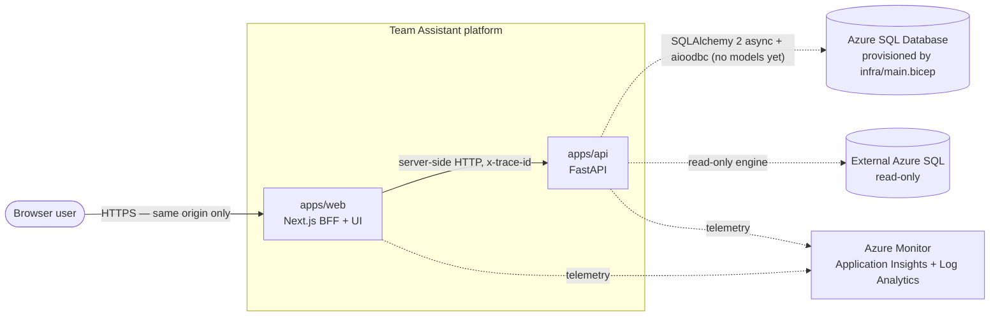
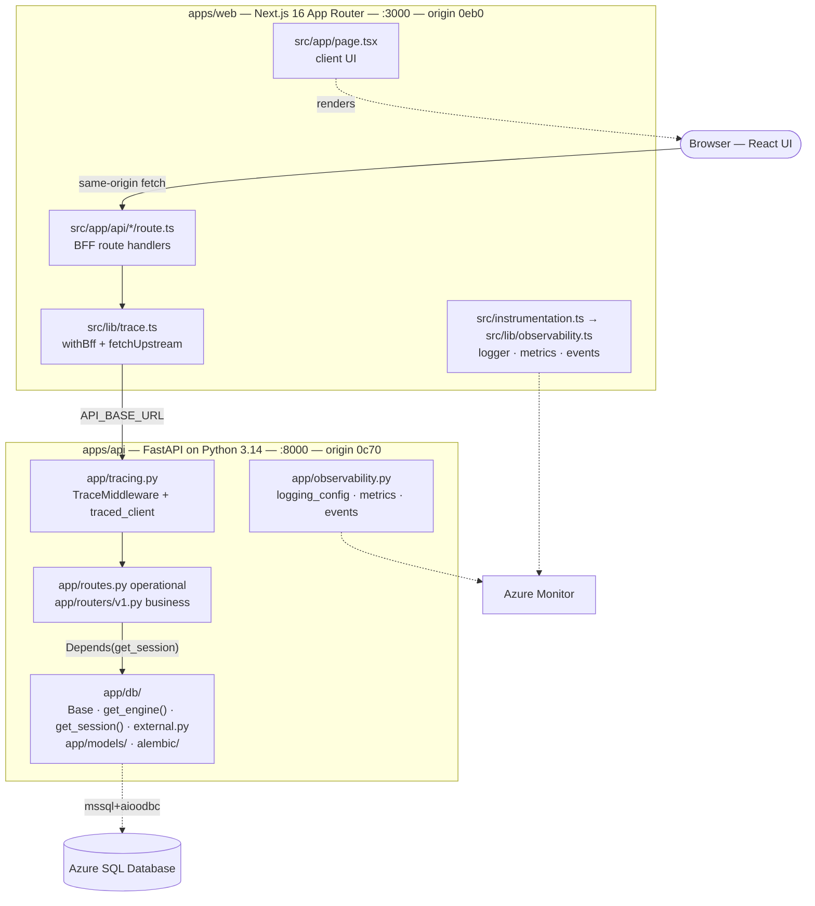
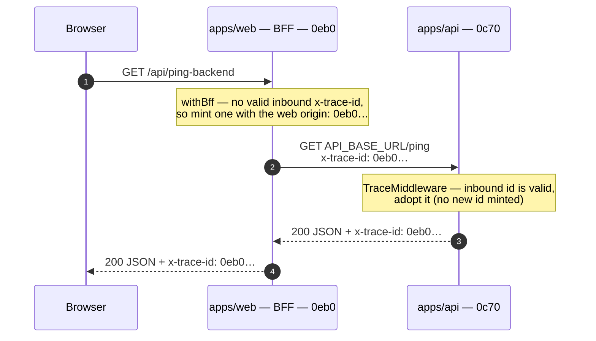

# System overview

The Team Assistant is the brandless **starter template / accelerator** that the [Diriyah Company](https://www.diriyahcompany.sa/en/)
AI team uses for its AI projects, built and maintained by [Orion Digital Solutions](https://www.orion360.com/). A project clones it,
renames the placeholders, and builds features on a foundation that already works end to end.

This document is the map of that foundation: the containers, the boundaries between them, the
request flows, and the reasoning behind the structural choices. Run instructions and the env
reference live in the root [`README.md`](../../README.md); this file explains the shape.

---

## What the template ships vs. what a project builds

The template deliberately ships **plumbing, not product**. Everything below the line is the
project's job.

| Capability                       | What it is                                                                                                                                                                                                  | Status                                                                             |
| -------------------------------- | ----------------------------------------------------------------------------------------------------------------------------------------------------------------------------------------------------------- | ---------------------------------------------------------------------------------- |
| **Cross-service foundation**     | two services (BFF + backend), end-to-end `trace_id`, Azure/OTel observability, `ping`/`health`/`info`                                                                                                       | ✅ Included (baseline)                                                             |
| **Business features**            | the project's actual domain modules, built on the foundation                                                                                                                                                | ⛔ Not included — built per project                                                |
| **Auth / RBAC**                  | authentication & authorization                                                                                                                                                                              | ⛔ Not included — needs a threat model + ADR                                       |
| **Database schema & migrations** | SQLAlchemy 2 async + Alembic (in `apps/api`) on Azure SQL Database — never local                                                                                                                            | ⏳ Empty model set, Alembic wired, no migrations; `migrate.yml` applies            |
| **Azure deployment (IaC)**       | Bicep, two tiers (ADR-0012): the project's container apps, Azure SQL, storage, Key Vault, App Insights, Search index on the cloud team's shared Foundry / Container Apps Environment / registry / AI Search | ⏳ Authored and `bicep build`-clean; not yet deployed (manifests are placeholders) |

(The same table, and the caveats around it, are in the root
[`README.md`](../../README.md) → _Scope & delivery status_.)

**Concretely, what runs today:** two services, one `x-trace-id` flowing unchanged through the
`web → api` hop, OpenTelemetry → Azure Monitor in both services with a fail-safe degraded
mode, and the operational endpoints `/ping`, `/info`, `/health`. There is no auth, no business
domain, no migrated database, and no deployed app hosting.

**Concretely, what a project adds:** domain modules under `/v1` in whichever service owns them
(mandatory versioning — [ADR-0001](../adr/0001-api-versioning.md)), SQLAlchemy models plus real
Alembic migrations, auth (after a threat model + ADR), and the app-hosting half of `infra/`.

> **History.** The template used to carry a third service, a **NestJS** `apps/api` layer that
> owned Prisma and sat between `web` and the FastAPI backend (then named `apps/python`). It was
> removed in [ADR-0003](../adr/0003-remove-nestjs-api-layer.md); the database moved to the FastAPI
> service on SQLAlchemy 2 async + Alembic in
> [ADR-0004](../adr/0004-sqlalchemy-async-alembic-db-layer.md); and the FastAPI service then took
> the `api` name in [ADR-0005](../adr/0005-name-services-by-role.md) — so today's `apps/api` is a
> **different service** from the removed one. The NestJS layer's trace origin `0a71` is retired
> and never reassigned; the FastAPI api keeps `0c70`.

---

## Context (C4 level 1)

Who and what the platform talks to. Only the browser is outside-in; everything else is
outbound from the platform.



Two properties are worth stating explicitly, because everything else follows from them:

1. **One inbound edge.** The browser reaches `apps/web` and nothing else.
2. **One trace id.** The solid arrow inside the platform carries the `x-trace-id` value that
   `web` minted, unchanged — see [tracing.md](tracing.md).
3. **One data owner.** Only `apps/api` talks to the database.

---

## Containers (C4 level 2)

The same picture one level down: what is inside each service, and which module owns each edge.



### The services

| App        | Stack                                                        | Port | Trace origin | OTel service name (cloud role) |
| ---------- | ------------------------------------------------------------ | ---- | ------------ | ------------------------------ |
| `apps/web` | Next.js 16.2.6 (App Router), BFF + UI                        | 3000 | `0eb0`       | `team-assistant-web`           |
| `apps/api` | Python 3.14 + FastAPI + SQLAlchemy 2 async + Alembic, via uv | 8000 | `0c70`       | `team-assistant-api`           |

Package managers: pnpm `11.5.2` for `web`, uv for `api`. Node **24** is pinned across
`.nvmrc`, the web Dockerfile, and its `engines` field. Both services are at version `0.0.0` and
version **independently** (root [`CLAUDE.md`](../../CLAUDE.md), rule 15).

The service-to-service URL comes from env: `API_BASE_URL` resolves to the Compose DNS name
inside the container network (`http://api:8000`) and defaults to `http://localhost:8000` when
running locally.

---

## The BFF pattern, and why

`apps/web` is a **Backend-for-Frontend**: the browser calls same-origin Next.js route handlers
under `src/app/api/*`, and those handlers call `apps/api` **server-side**.

The rule, stated as it is enforced (`.claude/rules/30-nextjs.md`, `50-security.md`): service
base URLs and secrets are **server-side env only — never `NEXT_PUBLIC_*`**, and a BFF handler
never proxies an arbitrary client-supplied URL.

Why it is worth the extra hop:

- **One browser origin.** No CORS configuration on the backends, no preflight surface, no
  per-service allowlist to maintain as services multiply.
- **Server-side secrets.** `API_BASE_URL` and every future credential stay in the Next
  server process. Anything prefixed `NEXT_PUBLIC_*` is inlined into the client
  bundle, which is exactly the mistake this rule exists to prevent.
- **One place to shape responses.** The BFF composes and trims upstream payloads for the UI,
  so backends stay resource-shaped instead of screen-shaped.
- **One place to degrade.** A failed upstream call returns a `502` carrying the `trace_id`
  (see `src/app/api/ping-backend/route.ts`), so the UI can show something useful and the user
  can quote an id that finds the request in Log Analytics.
- **A trace origin that matches reality.** Because the browser's first server-side hop is
  always `web`, a `0eb0…` trace id means "this started at a page interaction" — see
  [tracing.md](tracing.md) → _What origins tell you_.

The sanctioned outbound helpers make the boundary observable rather than merely documented:
`fetchUpstream` (web) and `traced_client` (api). Bare `fetch` / bare `httpx` is a
review-blocking violation.

---

## Request flows

The UI has two button rows — **Ping** (liveness) and **Info** (status · version · runtime).
Each button calls a same-origin BFF handler, which calls the api service:

| UI action | BFF route           | Upstream call |
| --------- | ------------------- | ------------- |
| Ping      | `/api/ping-backend` | `api /ping`   |
| Info      | `/api/info-backend` | `api /info`   |

Ping responses are `{ service, message, trace_id }`. Info responses add a consolidated report:
`{ status, service, version, env, uptime_seconds, runtime, system, observability, reason,
trace_id }`.

The flow, which exercises the one server-side hop:



`/api/info-backend` is the same picture against `/info`. In both, `web` is the origin, so the
hop carries a `0eb0…` id.

Each service also exposes an unversioned `/health` returning
`{ status, service, trace_id, observability, reason }` — the target of the Compose healthchecks
(`docker compose up` waits for them — `web` starts only once `api` is healthy — which is
why the first click works) and of the Azure availability webtests defined in `infra/`.

### API versioning

Every **business** endpoint is URI-versioned `/v1` in both services — mandatory, and enforced
structurally rather than by convention alone ([ADR-0001](../adr/0001-api-versioning.md),
[`.claude/rules/05-api-versioning.md`](../../.claude/rules/05-api-versioning.md)):

- **api** — business routers attach to `v1_router` (`app/routers/v1.py`, `prefix="/v1"`).
- **web** — business handlers live at `src/app/api/v1/<feature>/route.ts` and call the matching
  `/v1` upstream.

`/ping`, `/info`, and `/health` are the **only** exemption (container and Azure probes target
fixed paths). Adding another is an ADR change, not a code change.

---

## Why a monorepo of independent packages

One repository, two packages, **no pnpm workspace and no Turborepo**. Each app carries its
own lockfile, its own `Dockerfile`, and its own dependency graph.

The property this buys: `docker build apps/<svc>` works on its own, from that directory,
reproducibly. There is no root install step, no workspace-hoisted `node_modules` to reconstruct
inside the image, and no chance of one service's build silently resolving a dependency that
another service hoisted. A polyglot repo cannot share a lockfile with `apps/api` anyway
(uv manages that one), so a pnpm workspace would only ever cover the single Node package while
adding a resolution model every image build has to reproduce.

Consequences to know:

- Run app commands as `pnpm -C apps/<app> …` — **never** `pnpm --filter`, since there is no
  workspace to filter.
- The **pnpm** app (`web`) carries its own `pnpm-workspace.yaml` holding pnpm 11's
  build-script settings; its `Dockerfile` must copy the file into the deps stage for
  `pnpm install --frozen-lockfile`. `apps/api` is managed by uv instead (`uv.lock`).
- **There is no shared code package between services.** Duplication across the two tracing
  modules is deliberate: the contract is shared, the implementation is per-runtime (one Node,
  one Python). Introducing a shared package requires an ADR
  ([`.claude/rules/00-architecture.md`](../../.claude/rules/00-architecture.md)).
- The root `package.json` is a **tooling wrapper** (concurrently, prettier), not a release
  unit. `Makefile` and `justfile` keep parity so the same targets work on POSIX and Windows.

---

## Repo layout

```
.
├─ apps/
│  ├─ web/                # Next.js 16 — UI + BFF route handlers; /health
│  └─ api/                # FastAPI — /ping, /info, /health; owns the database
│     ├─ app/db/          #   SQLAlchemy 2 async: Base, lazy engine, get_session()
│     ├─ app/models/      #   ORM models (empty placeholder + commented example)
│     ├─ alembic/         #   Alembic env (async) + versions/ (empty)
│     └─ alembic.ini
├─ docs/                  # documentation hub — start at docs/README.md
│  ├─ architecture/       # this section — how the system is built and why
│  ├─ development/        # workflow, adding a feature, testing, coding standards
│  ├─ reference/          # HTTP API, env vars, commands
│  ├─ adr/                # numbered architecture decisions
│  ├─ operations/         # deployment, KQL starter pack, runbooks
│  └─ security/           # security posture + threat models
├─ infra/                 # main.bicep + main.<env>.bicepparam (use-case tier), modules/ (vendored blocks), platform/ (shared-tier manifests)
├─ .claude/               # rules, agents, skills, commands (the repo's working conventions)
├─ .github/               # CI, infra (Bicep what-if/deploy) and migrate (Alembic) workflows
├─ docker-compose.yml     # builds both services, one network, no database (Azure SQL only)
├─ Makefile / justfile    # task runner (parity)
├─ package.json           # root tooling (concurrently, prettier) + dev/fmt scripts
├─ .env.example           # root env (compose) — copy to .env
├─ .nvmrc                 # 24
└─ OBSERVABILITY-ROADMAP.md
```

Each app additionally holds its own `CLAUDE.md`, `.env.example`, `Dockerfile`, and test suite.

---

## Deliberate absences

Things that are missing on purpose. Each one is a decision, not an oversight — and each has a
defined way in.

| Absent                              | Why                                                                                                                                | The way in                                                                                                                              |
| ----------------------------------- | ---------------------------------------------------------------------------------------------------------------------------------- | --------------------------------------------------------------------------------------------------------------------------------------- |
| **Auth / RBAC**                     | Authentication shapes the threat surface, the trace/telemetry attributes, and the BFF contract — it cannot be retrofitted casually | Threat model (`threat-modeler`) **and** an ADR first, then implementation                                                               |
| **Business features**               | The template is domain-agnostic on purpose                                                                                         | Build under `/v1` per [ADR-0001](../adr/0001-api-versioning.md)                                                                         |
| **Database migrations**             | No reachable database is assumed; the model set is an empty placeholder and `alembic/versions/` is empty                           | Add models, `alembic revision --autogenerate` against the dev Azure SQL database, then the gated `migrate.yml` — see [data.md](data.md) |
| **A shared code package**           | Two runtimes, two lockfiles; a shared package would re-introduce the coupling the layout avoids                                    | ADR first ([`00-architecture.md`](../../.claude/rules/00-architecture.md))                                                              |
| **A local monitoring stack**        | The same code path must run locally and deployed; a local collector would create a second path that drifts                         | Point `APPLICATIONINSIGHTS_CONNECTION_STRING` at a real resource — see [observability.md](observability.md)                             |
| **A database container**            | Every database is Azure SQL by team decision (ADR-0008); a container would hide connection/TLS/identity realities                  | Point `DATABASE_URL` at the dev Azure SQL database — see [data.md](data.md)                                                             |
| **Applied infrastructure**          | `infra/main.bicep` is authored and builds clean against placeholder manifests; nothing is deployed yet                             | Cloud team's manifests + blocks → first `dev` deploy (two steps) — [`infra/README.md`](../../infra/README.md)                           |
| **A CI gate on unversioned routes** | Enforcement today is structural + scaffold + review; the gate is wanted but not yet written                                        | ADR, then a CI check ([`05-api-versioning.md`](../../.claude/rules/05-api-versioning.md))                                               |
| **A UI kit / client-state library** | Not mandated, so a project can pick its own                                                                                        | ADR ([`30-nextjs.md`](../../.claude/rules/30-nextjs.md))                                                                                |

---

## Where to go next

- [tracing.md](tracing.md) — the `trace_id` contract, in the detail needed to extend it.
- [observability.md](observability.md) — how telemetry is initialized, sampled, logged,
  exported, and degraded.
- [data.md](data.md) — the SQLAlchemy 2 async + Alembic posture and how to grow a real schema.
- [`docs/adr/`](../adr/) — the decisions behind all of the above.
