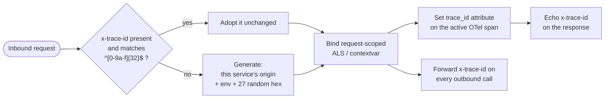

# The `trace_id` contract

**No request anywhere may exist without a `trace_id`.** It is generated at the true origin of a
request and propagated downstream **unchanged**, so one id identifies one user action across
every service it touched.

This is the template's single most load-bearing cross-service contract: changing it requires an
ADR ([`.claude/rules/00-architecture.md`](../../.claude/rules/00-architecture.md) → _What needs
an ADR_). The condensed version lives in the root [`README.md`](../../README.md) → _`trace_id` —
the invariant_ and in [`.claude/rules/60-observability.md`](../../.claude/rules/60-observability.md);
this document is the deep dive.

---

## Anatomy of an id

32 lowercase hex characters, three fields, no separators:

```
0eb0 0 f8e2c9a7b4d16035e9c2a8f4712
└┬─┘ │ └────────────┬────────────┘
 │   │              └─ 27 hex — 108 bits CSPRNG random
 │   └─ env (1 hex)
 └───── origin (4 hex)        →  32 hex chars total, regex ^[0-9a-f]{32}$
```

| Field  | Width  | Values                                                                                                                                                                             |
| ------ | ------ | ---------------------------------------------------------------------------------------------------------------------------------------------------------------------------------- |
| origin | 4 hex  | `web=0eb0` · `api=0c70` (the FastAPI api; kept across the rename, ADR-0005) · (`0a71` retired — the former **NestJS** `apps/api`, removed in ADR-0003; reserved, never reassigned) |
| env    | 1 hex  | `local=0` · `dev=1` · `staging=2` · `prod=3` · (`sandbox=4` reserved/unused)                                                                                                       |
| random | 27 hex | CSPRNG (Node `randomBytes(14)` / Python `secrets.token_hex(14)`, sliced)                                                                                                           |

Notes that matter when you touch the code:

- **Validation is exactly `^[0-9a-f]{32}$`** — the origin and env fields are _not_ validated
  against the known value sets on the way in. An inbound id from a service you did not write is
  adopted as long as it is 32 lowercase hex characters. That is deliberate: adoption must never
  fail closed and start a second trace mid-chain.
- **The random field is 27 hex, not 28.** Both runtimes generate 14 random bytes (28 hex) and
  slice to 27, so the total lands on 32 — the same width as a W3C trace id (see below).
- **An unknown or missing `APP_ENV` maps to `local` (`0`)**, in both services. There is no
  "unknown" nibble.
- **Origin `0a71` is retired, not free.** It belonged to the former **NestJS** `apps/api` service
  removed in [ADR-0003](../adr/0003-remove-nestjs-api-layer.md) — a different service from
  today's FastAPI `apps/api`, which kept its origin `0c70` when it took the `api` name
  ([ADR-0005](../adr/0005-name-services-by-role.md)). `0a71` stays reserved so historical
  telemetry keeps its meaning; a new service gets a new origin, never this one.
- The canonical header is **`x-trace-id`**, lowercase, everywhere.

---

## Lifecycle: adopt → store → forward → echo

Every service implements the same four steps, in its own runtime's idiom.



**1. Adopt or generate.** A valid inbound id is adopted verbatim. Otherwise the service mints
one with **its own** origin. Consequence: the first service a request reaches is the one that
stamps the origin — which is what makes the origin field diagnostic.

**2. Store request-scoped.** Node uses `AsyncLocalStorage`, Python uses `contextvars`. Both
give any code running inside the request — a logger, a metric recorder, an outbound helper —
access to the id without threading it through every signature. Outside a request scope both
return "no id" (`undefined` / `None`) rather than inventing one.

**3. Forward on every outbound call.** This is why the sanctioned HTTP wrappers exist and why
bare `fetch` / bare `httpx` are review-blocking violations: propagation must be structural, not
remembered.

**4. Echo on the response.** Every response carries `x-trace-id`, so a caller (including the
browser, and the BFF's own `502` bodies) can quote the id that identifies the failure.

**And, for correlation:** the id is set as a `trace_id` **attribute on the active OTel span**
and included as a `trace_id` **field on every structured log line**.

---

## Per-service implementation

Same contract, two implementations. Read these files before changing anything here.

### `apps/web` — Next.js BFF (origin `0eb0`)

| Concern              | Where                                                                                                                                                            |
| -------------------- | ---------------------------------------------------------------------------------------------------------------------------------------------------------------- |
| Constants + helpers  | [`apps/web/src/lib/trace.ts`](../../apps/web/src/lib/trace.ts) — `ORIGIN`, `TRACE_HEADER`, `TRACE_ID_REGEX`, `envHex`, `generateTraceId`, `isValidTraceId`       |
| Adopt / store / echo | `withBff(req, handler, options?)` in the same file — resolves the inbound id, runs the handler inside `runWithTrace`, sets `x-trace-id` on the returned response |
| Read the id          | `getTraceId()`                                                                                                                                                   |
| Forward              | `fetchUpstream(url, traceId, init?)` — sets `x-trace-id` (and `accept: application/json`, `cache: 'no-store'`)                                                   |

Next.js has no global middleware hook in this design: `withBff` is the wrapper every BFF route
handler opts into. It takes the trace id as an explicit argument on `fetchUpstream` rather than
reading the store, which keeps the propagation visible at each call site.

### `apps/api` — FastAPI (origin `0c70`)

| Concern              | Where                                                                                                                                                                                    |
| -------------------- | ---------------------------------------------------------------------------------------------------------------------------------------------------------------------------------------- |
| Constants + helpers  | [`apps/api/app/tracing.py`](../../apps/api/app/tracing.py) — `ORIGIN`, `TRACE_HEADER`, `env_hex`, `generate_trace_id`, `is_valid_trace_id`, the `_trace_id_var` contextvar               |
| Adopt / store / echo | `TraceMiddleware` (pure-ASGI) in the same file — added in `create_app()`; rewrites the response headers in a `send` wrapper so any pre-existing `x-trace-id` is replaced, not duplicated |
| Read the id          | `get_trace_id()`                                                                                                                                                                         |
| Forward              | `traced_client(**kwargs)` — an `httpx.AsyncClient` pre-loaded with `forward_headers()`                                                                                                   |

`TraceMiddleware` is pure ASGI rather than a Starlette `BaseHTTPMiddleware` subclass, so it sees
the raw scope and can read the inbound header and patch `http.response.start` directly. The
contextvar token is reset in a `finally`, so the id never leaks between requests on the same
task.

> The two modules are intentionally **not** shared code. There is no cross-service package in
> this repo (introducing one needs an ADR), and the runtimes differ (Node and Python). The shared
> thing is the contract on the wire; each service's tests assert it independently.

---

## Relationship to the W3C / OpenTelemetry trace id

They are **two different identifiers**, and conflating them is the most likely mistake when
extending this system.

|                                | `x-trace-id` (this repo)                                              | `traceparent` (W3C, carried by OTel)                              |
| ------------------------------ | --------------------------------------------------------------------- | ----------------------------------------------------------------- |
| Who sets it                    | Our trace middleware / BFF wrapper                                    | The OTel instrumentation layer (undici on Node, httpx on Python)  |
| Header                         | `x-trace-id`                                                          | `traceparent` (+ `tracestate`)                                    |
| Shape                          | 32 hex: origin + env + random                                         | 32 hex, fully random, plus a 16-hex span id and flags             |
| Encodes provenance?            | Yes — origin and env are readable                                     | No                                                                |
| Where it lands in App Insights | `trace_id` span attribute + `trace_id` log field (`customDimensions`) | `operation_Id` on `AppRequests` / `AppDependencies` / `AppTraces` |

Both travel on **the same outbound call**: the sanctioned wrapper adds `x-trace-id`, and the
instrumentation below it adds `traceparent` and emits the dependency span
([`60-observability.md`](../../.claude/rules/60-observability.md) → _Distributed traces_).

They are **correlated, not merged**: the trace middleware calls
`trace.getActiveSpan()?.setAttribute('trace_id', traceId)`, and every structured log line
carries the same value. So from either identifier you can reach the other — start from a
`trace_id` a user quoted, find the `operation_Id`, and pivot into the full OTel trace; or start
from a slow `AppRequests` row and read its `trace_id` attribute.

Why keep a second id at all, rather than surfacing the OTel one? Because the OTel trace id
exists only when a tracer provider is registered — and this template is explicitly designed to
run in **degraded mode** with no Azure connection string. `trace_id` is generated by our own
code, so it is present in stdout logs and in every response body and header whether or not
telemetry is enabled. It also carries provenance the W3C id cannot.

---

## What origins tell you

Because a service only mints an id when the inbound one is absent or invalid, the origin field
answers "where did this request enter the platform?" at a glance:

| Prefix  | Read it as                                                                                                                                                |
| ------- | --------------------------------------------------------------------------------------------------------------------------------------------------------- |
| `0eb0…` | Entered at the **web BFF** — i.e. a browser interaction. Every hop of a normal user flow looks like this.                                                 |
| `0c70…` | Entered at the **api** (FastAPI) directly — a `curl`, a probe, a scheduled job, or a caller bypassing the BFF.                                            |
| `0a71…` | **Historical only** — minted by the former **NestJS** `apps/api` before ADR-0003 (not today's FastAPI api, which uses `0c70`). Never seen on new traffic. |

A `0c70…` id appearing on a request path that is supposed to be browser-driven means something
called the `api` directly, or the BFF failed to forward the header. Similarly, a BFF request whose
api-side rows carry a **different** id than the web-side rows means propagation broke at that
hop — inspect the wrapper used at that call site.

The env nibble is the second digit after the origin: `0eb00…` is local, `0eb03…` is prod. Useful
when a support ticket quotes an id and you need to know which environment to query before you
query it.

---

## Reading a trace in Log Analytics

Start from the id the user (or the `502` body, or the response header) gave you. The queries are
in the **[KQL starter pack](../operations/kql-starter-pack.md)**:

- **§1 Trace-by-id lookup** — every row across the pillars for one repo `trace_id`.
- **§2 A request and its logs together** — the join proving `AppTraces.operation_Id` matches the
  request span, which is what the log-export bridge exists to guarantee
  ([observability.md](observability.md) → _The log pipeline_).
- **§4 Dependency latency** — the service-to-service hops (and DB calls) of that trace.

If a trace is missing entirely rather than incomplete, the problem is upstream of the query:
work through [degraded-mode triage](../operations/runbooks/observability-degraded.md), and after
a deploy run the [post-deploy smoke](../operations/runbooks/post-deploy-smoke.md), which proves
each pillar table by table. App Insights fails silent — an empty result is not evidence that the
request did not happen.

---

## Extending the contract

When you add a route, an outbound call, or a background operation:

1. **Inbound HTTP** — nothing to do in the `api` (its middleware is global). In `web`, wrap the
   handler in `withBff`; pass `{ routeClass }` if the route has a dynamic segment, so the
   request-duration metric stays bounded.
2. **Outbound HTTP** — use `fetchUpstream` / `traced_client()`. Never a bare client. Give it a
   timeout ([`50-security.md`](../../.claude/rules/50-security.md)).
3. **Work outside a request scope** (queue consumers, cron, `finish` handlers) — there is no
   ambient id. Generate one with the service's `generateTraceId()` and bind it, or pass the id
   explicitly into the log call as `trace_id`.
4. **Logging** — always through the service's structured logger, never `console.log` / `print()`.
5. **Tests** — every suite already asserts adopt / regenerate / echo; extend them for new
   surfaces. `make test` runs both.

The `observability-instrumenter` agent exists for exactly this work
([`CLAUDE.md`](../../CLAUDE.md) → _The `.claude/` toolkit_) — invoke it deliberately, after
confirmation, not automatically.
