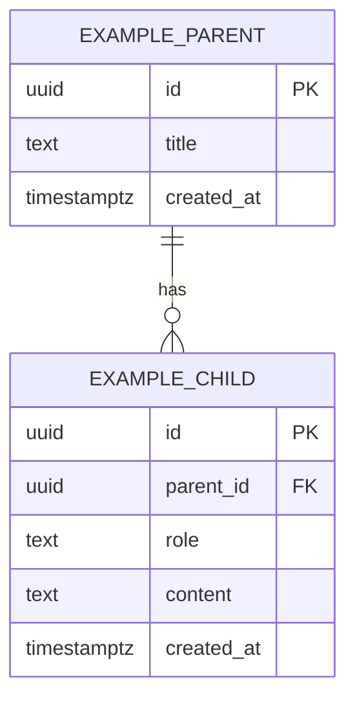

# Database design — project database

_The project's **own** Azure SQL Database (created by the use-case Bicep deployment before any model work — root
`CLAUDE.md` → "What you cannot do"; there is no local database). External databases go in
[`external-systems.md`](external-systems.md), not here._

## Overview

- **Azure resource:** logical server `sql-sandbox-test2-fayed` · database
  `sqldb-sandbox-test2-yasser` · environment: dev only — **pre-provisioned**, not created by this
  project's Bicep (`ARCHITECTURE.md` → B1)
- **Access from `apps/api`:** read/write via `DATABASE_URL` (Key Vault secret `DATABASE-URL`;
  managed identity when deployed)
- **Service tier / SKU:** _(e.g. `S0` dev, `S2` prod — decides whether `ONLINE` index builds are available)_
- **Conventions:** UUID primary keys (`UNIQUEIDENTIFIER`), `created_at`/`updated_at` with server
  defaults, snake_case table/column names, a length on every string column, constraints named by
  the template's naming convention (`app/db/base.py`)

## Entity diagram

_Replace the example with the real entities._

## Tables

### `<table_name>`

| Column       | Type          | Null | Default | Notes |
| ------------ | ------------- | ---- | ------- | ----- |
| `id`         | `uuid`        | no   | `gen`   | PK    |
| `created_at` | `timestamptz` | no   | `now()` |       |
|              |               |      |         |       |

- **Indexes:** _(columns, unique?)_
- **Foreign keys:** _(→ table.column, on delete)_
- **PII / retention:** _(class, retention period, purge procedure)_
- **Expected volume:** _(rows/day, growth — drives concurrency-safe DDL decisions)_

_(repeat per table)_

## Migration notes

- Anything that must happen outside Alembic (extensions, roles, seed data) and who runs it.
- Backfills or multi-step changes planned for populated tables.
