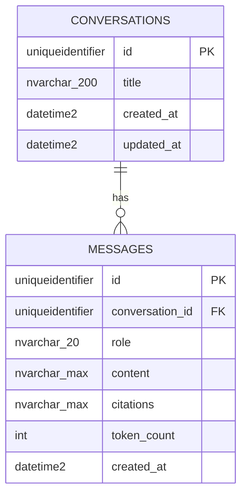

# Database design — project database

_The project's **own** Azure SQL Database (created by the use-case Bicep deployment before any model work — root
`CLAUDE.md` → "What you cannot do"; there is no local database). External databases go in
[`external-systems.md`](external-systems.md), not here._

## Overview

- **Azure resource:** logical server `sql-sandbox-test2-fayed` · database
  `sqldb-sandbox-test2-yasser` · environment: dev only — **pre-provisioned**, not created by this
  project's Bicep (`ARCHITECTURE.md` → B1)
- **Access from `apps/api`:** read/write via `DATABASE_URL` in the gitignored `apps/api/.env`
  (no Key Vault, no deployment — ADR-0013)
- **Service tier / SKU:** _(e.g. `S0` dev, `S2` prod — decides whether `ONLINE` index builds are available)_
- **Conventions:** UUID primary keys (`UNIQUEIDENTIFIER`), `created_at`/`updated_at` with server
  defaults, snake_case table/column names, a length on every string column, constraints named by
  the template's naming convention (`app/db/base.py`)

## Entity diagram

Source of truth: [`TAChatbot/architecture.md` → B4](../architecture/TAChatbot/architecture.md#b4-data-stores-azure-sql-owned-by-appsapi).

## Tables

### `conversations`

| Column       | Type               | Null | Default            | Notes                                                                                |
| ------------ | ------------------ | ---- | ------------------ | ------------------------------------------------------------------------------------ |
| `id`         | `uniqueidentifier` | no   | —                  | PK                                                                                   |
| `title`      | `nvarchar(200)`    | no   | `New conversation` | given on create, else renamed on the first ask to the question cut to 200 characters |
| `created_at` | `datetime2(3)`     | no   | server default     |                                                                                      |
| `updated_at` | `datetime2(3)`     | no   | server default     | bumped on every new message — the list is ordered by it, newest first                |

- **Indexes:** `updated_at` (list ordering)
- **Foreign keys:** none
- **PII / retention:** titles can echo user text — same class as `messages.content`; kept indefinitely
- **Expected volume:** low — one team's conversations

### `messages`

| Column            | Type               | Null | Default        | Notes                                                                      |
| ----------------- | ------------------ | ---- | -------------- | -------------------------------------------------------------------------- |
| `id`              | `uniqueidentifier` | no   | —              | PK                                                                         |
| `conversation_id` | `uniqueidentifier` | no   | —              | FK → `conversations.id`                                                    |
| `role`            | `nvarchar(20)`     | no   | —              | `CHECK (role IN ('user','assistant'))`                                     |
| `content`         | `nvarchar(max)`    | no   | —              | user question (≤ 4,000 characters) or assistant answer                     |
| `citations`       | `nvarchar(max)`    | yes  | —              | JSON `[{title, path}]`; `CHECK (citations IS NULL OR ISJSON(citations)=1)` |
| `token_count`     | `int`              | yes  | —              |                                                                            |
| `created_at`      | `datetime2(3)`     | no   | server default |                                                                            |

- **Indexes:** `conversation_id` (+ `created_at` for in-order reads)
- **Foreign keys:** `conversation_id` → `conversations.id`, `ON DELETE NO ACTION` (no delete feature)
- **PII / retention:** free text typed by internal users, may contain personal data; kept
  indefinitely, no purge job; never logged (rules 60/70)
- **Expected volume:** low — a few messages per question

## Migration notes

- No extensions, roles or seed data outside Alembic.
- The first revision creates both tables on an empty database; no backfills.
- Revisions are reviewed offline (`alembic upgrade head --sql`) and applied by Yasser Aly from a
  developer machine against dev — never by an agent, no `migrate.yml` (ADR-0013).
